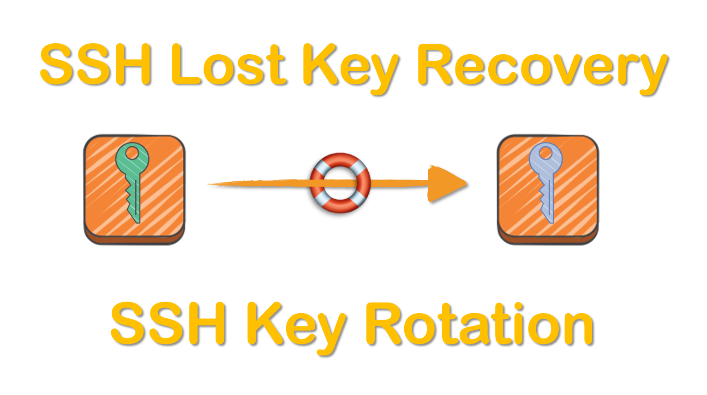

# 👮 AWS Security - Recover or Rotate SSH Keys using SSM

  We will use [AWS SSM](https://www.youtube.com/watch?v=5JnOVMb4lTs) to recover a server for which there is no ssh key is attached or A server for which the SSH key is lost <sup>[Ref][1]</sup>.  We can use the similar technique to rotate the ssh keys for security reasons.

  This method of recovering or rotating the keys depends on two key aspects of AWS SSM,
  
  1. Your instance is running [SSM Agent](https://github.com/miztiik/AWS-Demos/tree/master/How-To/setup-ssm-hybrid-environment#install-ssm-client-on-on-prem-servers). _If the agent is not installed, it can be manually set up according to [documentation](https://docs.aws.amazon.com/systems-manager/latest/userguide/sysman-manual-agent-install.html)_.
  1. Your instance SSM agents connects to SSM Service - aka the instance has an instance profile attached with necessary permissions
  
  

  Follow this article in **[][101]**

## Lab Setup

  You have couple of options to set this up in your account, You can use [AWS CDK](https://www.youtube.com/watch?v=MKwxpszw0Rc) or use the cloudformation template generated by CDK. All the necessary steps are baked into the templates, you can launch it and try it out.

### Method 1: Using AWS CDK

  If you have AWS CDK installed you can close this repository and deploy the stack with,

  ```sh
  git clone git@github.com:miztiik/dev-sec-ops.git
  cd ./dev-sec-ops/rotate-recover-ec2-ssh-keys/
  source .env/bin/activate
  cdk deploy
  ```

### Method 2: Using AWS CloudFormation

  If you are using cloudformation, download the templates are under `cdk.out` directory. The stack name is usually `DIR_NAME.template.json`. You can deploy them through GUI or console.
  _From the CLI,_

  ```bash
  aws cloudformation deploy \
        --template-file rotate-recover-ec2-ssh-keys.template.json \
        --stack-name "MiztiikStack" \
        --capabilities CAPABILITY_IAM
  ```

#### Steps to create new keys in terminal

  ```bash
  # To generate public key
  ssh-keygen -t rsa -N “” -q -f YOUR-KEY-NAME

  # To add public key in run command
  #!/bin/bash
  echo -e "YOUR-PUBLIC-KEY-BETWEEN-QUOTES" >> /home/ec2-user/.ssh/authorized_keys
  ```

## 📌 Who is using this

This  [course][101] uses this repository extensively to teach advanced AWS Cloud Security to new developers, Solution Architects & Ops Engineers in AWS.

### 💡 Help/Suggestions or 🐛 Bugs

Thank you for your interest in contributing to our project. Whether it's a bug report, new feature, correction, or additional documentation or solutions, we greatly value feedback and contributions from our community. [Start here][200]


### 📚 References

1. [Recover Lost Key Pair of AWS EC2 using Userdata][1]
1. [Recover Key Pair of AWS EC2][2]

### 🏷️ Metadata

**Level**: 100

[1]: https://www.youtube.com/watch?v=Bqt538HRsws

[2]: https://www.youtube.com/watch?v=5btWXn4yWzQ

[100]: https://www..com/course/aws-cloud-security/?referralCode=B7F1B6C78B45ADAF77A9

[101]: https://www..com/course/aws-cloud-security-proactive-way/?referralCode=71DC542AD4481309A441

[102]: https://www..com/course/aws-cloud-development-kit-from-beginner-to-professional/?referralCode=E15D7FB64E417C547579

[103]: https://www..com/course/aws-cloudformation-basics?referralCode=93AD3B1530BC871093D6

[200]: https://github.com/miztiik/dev-sec-ops/issues

[899]: https://www..com/user/n-kumar/

[900]: https://ko-fi.com/miztiik
